# Entity Availability for Home Assistant

<a href="https://github.com/italo-lombardi/Home-Assistant-EntityAvailability/releases"></a>
<a href="https://github.com/hacs/integration"></a>
<a href="https://github.com/italo-lombardi/Home-Assistant-EntityAvailability"></a>
<a href="https://www.home-assistant.io/"></a>
<a href="https://github.com/italo-lombardi/Home-Assistant-EntityAvailability/blob/main/LICENSE"></a>

[](https://buymeacoffee.com/italolombardi)
[](https://paypal.me/ItaloLombardi)

[](https://my.home-assistant.io/redirect/hacs_repository/?owner=italo-lombardi&repository=Home-Assistant-EntityAvailability&category=integration)
[](https://my.home-assistant.io/redirect/config_flow_start/?domain=entity_availability)

Monitor entity availability in Home Assistant. Track offline entities, availability history, and degraded states with a custom dashboard card.

---

## Features

- **Multi-group support** -- organize entities by function (Security, Climate, Media, etc.)
- **Combined groups** -- merge multiple groups into a single aggregate sensor set for cross-group automations (offline count, low battery, any-offline binary sensor)
- **Configurable bad states** -- define which states count as offline (`unavailable`, `unknown`, or custom)
- **Cooldown timer** -- ignore brief blips before marking an entity offline
- **Availability % sensors** -- track uptime over today, 3-day, 5-day, and 7-day windows
- **Reliability sensors (MTBF + MTTR)** -- flag devices that keep flaking out: separate diagnostic sensors for how *often* each device breaks (MTBF) and how *long* each outage lasts (MTTR), so a genuinely flaky device is distinguishable from one that had a single long outage at the same uptime %
- **Bus events** -- fires `entity_availability_offline` / `entity_availability_recovered` on the HA event bus for use as native automation triggers
- **Battery monitoring** -- auto-detect or manually map battery entities; supports numeric (%) and text states (`low`)
- **Degraded entity detection** -- flag entities with low battery or stale data
- **Recently offline / recovered sensors** -- track which entities went offline or recovered within a configurable time window
- **Device name display** -- optionally show the HA device name instead of entity friendly name in offline/recovered sensor states
- **Indefinite suppression** -- suppress an entity with no expiry via `suppress_indefinitely`
- **Maintenance/suppression mode** -- temporarily exclude entities from monitoring
- **Custom Lovelace card** -- traffic-light status display with at-a-glance health overview
- **Self-managed storage** -- no recorder dependency; data stored in `.storage`
- **Recorder-friendly writes** -- sensors only publish state when value or attributes actually change, so steady-state networks don't generate redundant history rows every coordinator tick
- **Survives HA restarts** -- availability history persisted via HA Store

---

## Installation

### HACS (Recommended)

1. Open HACS in your Home Assistant instance.
2. Go to **Integrations** and click the three-dot menu.
3. Select **Custom repositories**.
4. Add `https://github.com/italo-lombardi/Home-Assistant-EntityAvailability` with category **Integration**.
5. Click **Install** and restart Home Assistant.

### Manual

1. Download the [latest release](https://github.com/italo-lombardi/Home-Assistant-EntityAvailability/releases).
2. Copy the `custom_components/entity_availability/` folder into your `config/custom_components/` directory.
3. Restart Home Assistant.

---

## Configuration

This integration uses a config flow accessible from **Settings > Devices & Services > Add Integration > Entity Availability**.

### Step 1: Choose Entry Type

Choose whether to monitor a group of entities or combine existing groups.

| Option | Description |
|--------|-------------|
| Monitor entities | Create a new group of entities to monitor |
| Combine groups | Aggregate two or more existing groups into one (requires at least 2 groups already created) |

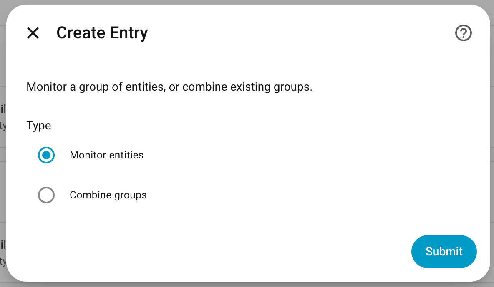

### Step 2a: Create Entity Group (Monitor entities path)

| Field | Description |
|-------|-------------|
| Group Name | A descriptive name for this group (e.g., "Security Cameras") |
| Entities to Monitor | Select the entities you want to track |

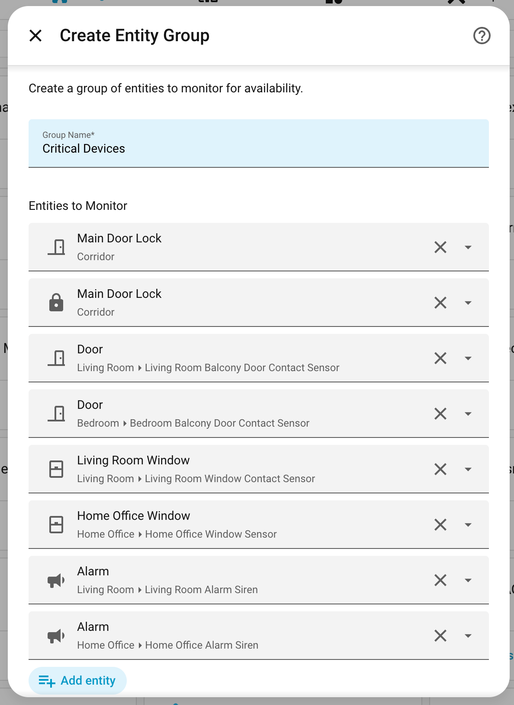

### Step 3: Monitoring Settings

| Field | Default | Description |
|-------|---------|-------------|
| States considered offline | `unavailable`, `unknown` | States that mark an entity as offline |
| Cooldown (seconds) | `60` | Time to wait before confirming an entity is offline |
| Staleness threshold (minutes) | `0` (disabled) | Mark entity degraded if no state change in this time |

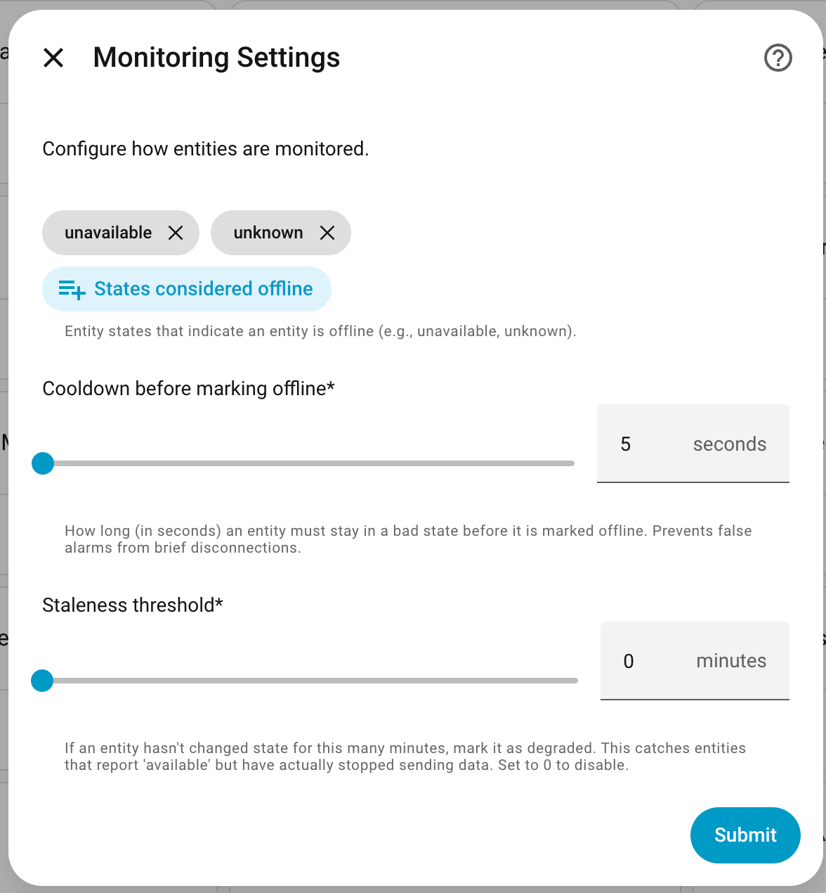

### Step 4: Advanced Settings

| Field | Default | Description |
|-------|---------|-------------|
| Low battery threshold (%) | `20` | Battery level below which an entity is considered degraded (0 = disabled) |
| Availability tracking windows | `today`, `7d` | Which time windows to create availability sensors for |
| Recovery window (minutes) | `5` | How long entities remain visible in the recently-offline and recently-recovered sensors after the event |
| Show device names | `off` | When enabled, offline/recovered sensor states show the HA device name (e.g. "Entrance Smoke Detector") instead of the entity friendly name. Falls back to friendly name for entities not linked to an HA device (helpers, template sensors) |

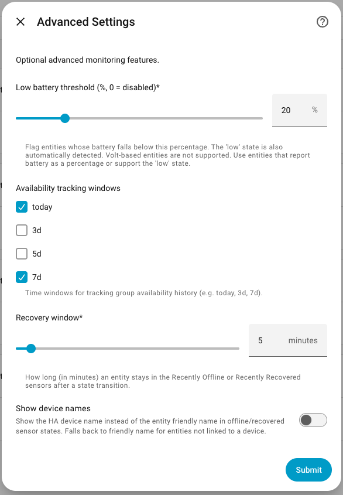

### Step 5: Battery Entity Mapping (when battery threshold > 0)

If you enable battery monitoring, a confirmation step appears showing each monitored entity with its auto-detected battery sensor. You can:

- **Confirm** the auto-detected battery entity
- **Override** with a different battery sensor
- **Leave empty** for entities that don't have batteries (e.g., smart plugs, cloud services)

Auto-detection checks battery sensors linked to the same device in Home Assistant, or sensors named `sensor.{entity_name}_battery`.

Battery sensors that report `low` (text) are supported in addition to numeric percentages.

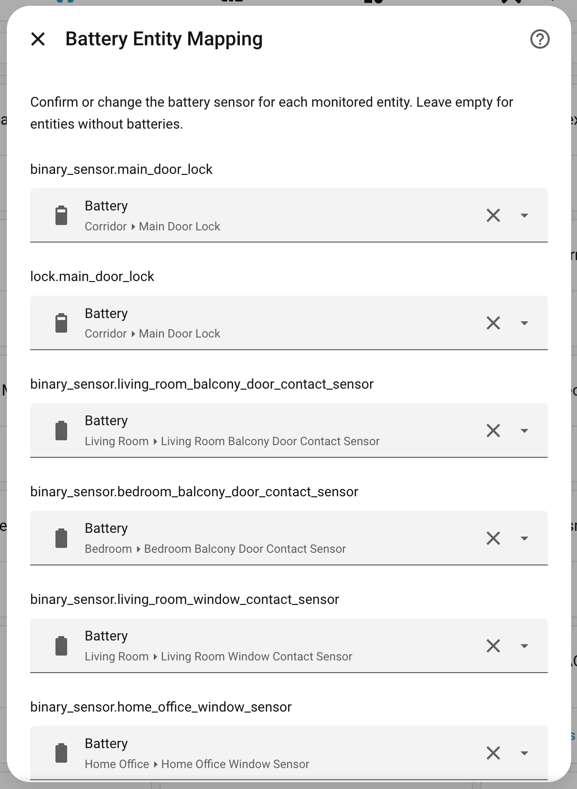

### Step 2b: Create Combined Group (Combine groups path)

| Field | Description |
|-------|-------------|
| Combined Group Name | A descriptive name (e.g., "All Devices") |
| Groups to Include | Select two or more existing Entity Availability groups |

No further steps — combined groups read live from their source groups and require no additional configuration.

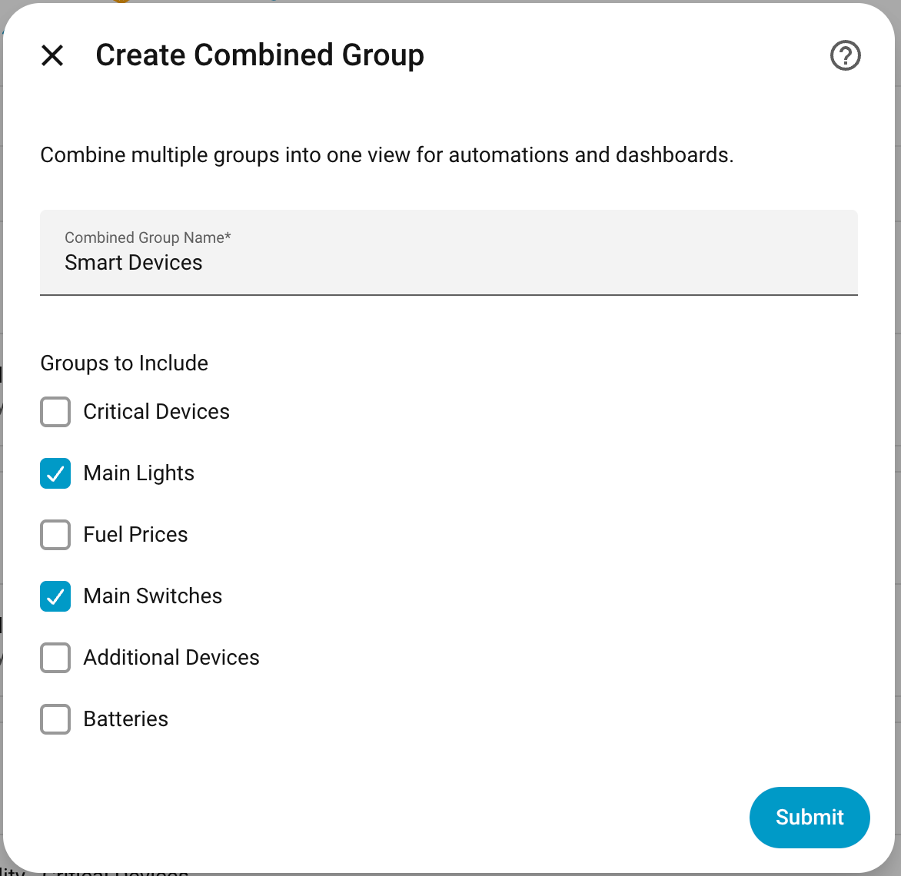

### Options Flow

All settings can be edited after creation via **Settings > Devices & Services > Entity Availability > Configure**.

---

## Sensors Created

For each configured group, the following entities are created. All entity IDs use the prefix `entity_availability_` followed by the group slug (the lowercased, underscore-separated version of your group name).

For example, a group named "Security Devices" produces the slug `security_devices`:

| Entity | Type | State | Attributes |
|--------|------|-------|------------|
| `sensor..._offline_count` | Sensor | Number of entities currently offline | Per-entity dict keyed by entity ID: `offline` (bool), `since` (ISO timestamp or null), `last_recovery` (ISO timestamp or null), `last_downtime_seconds` (float or null) |
| `sensor..._offline_entities` | Sensor | Comma-separated list of offline entity names (`"None"` when all online) | Full entity list, count |
| `sensor..._recently_offline` | Sensor | Comma-separated friendly names of entities that went offline within the recovery window (`"None"` when empty) | `entities` (list of entity IDs), `count`, `window_minutes` |
| `sensor..._recently_recovered` | Sensor | Comma-separated friendly names of entities that recovered from offline within the recovery window (`"None"` when empty) | `entities` (list of entity IDs), `count`, `window_minutes` |
| `sensor..._low_battery` | Sensor | Comma-separated list of low battery entities (`"None"` when all OK) | Per-entity battery levels, count |
| `sensor..._low_battery_count` | Sensor | Number of entities with low battery | — |
| `sensor..._group_summary` | Sensor | Total entity count in the group | total_entities, online, offline, suppressed, battery_powered, low_battery |
| `sensor..._availability_today` | Sensor | Group availability % for today | Per-entity availability breakdown |
| `sensor..._availability_3d` | Sensor | Group availability % over 3 days | Per-entity availability breakdown |
| `sensor..._availability_5d` | Sensor | Group availability % over 5 days | Per-entity availability breakdown |
| `sensor..._availability_7d` | Sensor | Group availability % over 7 days | Per-entity availability breakdown |
| `sensor..._mtbf` | Sensor (Diagnostic) | Group mean MTBF in hours (mean time between failures) | `total_offline_events`, `per_device` (`mtbf_hours`, `offline_events`) |
| `sensor..._mttr` | Sensor (Diagnostic) | Group mean MTTR in minutes (mean time to recovery / average outage length) | `total_offline_events`, `per_device` (`mttr_minutes`, `offline_events`) |
| `binary_sensor..._any_offline` | Binary Sensor (Problem) | ON when at least one entity is offline | offline_entities, offline_count |
| `sensor..._affected_areas_count` | Sensor | Number of unique HA areas containing ≥1 offline, unsuppressed entity | — |
| `sensor..._affected_areas` | Sensor | Comma-separated sorted list of affected area names (`"None"` when none) | `areas` (list), `count`, `unassigned_entities` (entity IDs with no area) |
| `sensor..._affected_areas_recently_offline` | Sensor | Areas where ≥1 entity went offline within the recovery window (`"None"` when none) | `areas` (list), `count`, `window_minutes` |
| `sensor..._affected_areas_recently_recovered` | Sensor | Areas where all entities are back online and most recent recovery is within the recovery window (`"None"` when none) | `areas` (list), `count`, `window_minutes` |

> **Note:** The Low Battery and Low Battery Count sensors are only created when battery threshold > 0. Availability window sensors are only created for windows selected during configuration. The recently-offline and recently-recovered sensors are always created regardless of battery threshold.

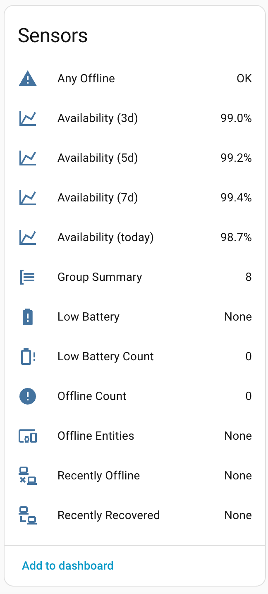

### Group Summary Sensor

The Group Summary sensor provides a complete overview in its attributes:

| Attribute | Description |
|-----------|-------------|
| `total_entities` | Total number of entities in the group |
| `online` | Number of entities currently online |
| `offline` | Number of entities currently offline (excluding suppressed) |
| `suppressed` | Number of suppressed entities |
| `battery_powered` | Number of entities with a mapped battery sensor |
| `low_battery` | Number of entities with battery below threshold |
| `entities` | List of all monitored entity IDs in this group |
| `battery_levels` | Dict of `{entity_id: battery_level}` for entities with battery sensors |
| `suppressed_until` | Which entities are suppressed and when the suppression expires |
| `stale_entities` | Entities that haven't reported a state change longer than the staleness threshold |
| `offline_since` | When each currently offline entity first went offline |

Access these in templates:

```yaml
{{ state_attr('sensor.entity_availability_security_devices_group_summary', 'battery_powered') }}
{{ state_attr('sensor.entity_availability_security_devices_group_summary', 'offline') }}
```


### Recovery Attributes

When an entity comes back online, the `offline_count` sensor includes:

- `last_recovery` -- timestamp of when the entity came back online
- `last_downtime_seconds` -- how long the entity was offline (seconds)

### Recently Offline / Recently Recovered Sensors

These sensors keep a rolling record of activity within the configured recovery window (default 5 minutes). They are always created for every group, regardless of the battery threshold setting.

| Sensor | State | Attributes |
|--------|-------|------------|
| `sensor..._recently_offline` | Comma-separated friendly names of entities that went offline within the window (`"None"` when empty) | `entities` (list of entity IDs), `count`, `window_minutes` |
| `sensor..._recently_recovered` | Comma-separated friendly names of entities that recovered from offline within the window (`"None"` when empty) | `entities` (list of entity IDs), `count`, `window_minutes` |

The window length is controlled by the **Recovery window** setting in Advanced Settings (Step 4) and can be changed at any time via the Options flow.

Use these sensors in automations to get the exact device name(s) at the moment of an event — see the [Automation Ideas](#automation-ideas) section for examples.

### Reliability (MTBF / MTTR) Sensors

**In one line:** these sensors flag devices that keep flaking out, so you know what to fix or replace.

The availability % sensor tells you *how much* total downtime a group had. It does **not** tell you whether that was one long outage or lots of tiny ones. Two separate sensors answer two different questions:

- **How often do devices break?** → **MTBF** (Mean Time Between Failures) — the `Mean Time Between Failures` sensor (`sensor..._mtbf`), in hours.
- **How long is each break?** → **MTTR** (Mean Time To Recovery) — the `Mean Time To Recovery` sensor (`sensor..._mttr`), in minutes.

Both are **diagnostic** entities (grouped under the device's Diagnostic section, kept off the main dashboard) with `device_class: duration`, so Home Assistant renders them as durations and lets you convert units in the UI.

**Why it matters — two devices can look identical on %, but be very different:**

| | Breaks how often | Down how long | Verdict |
|---|---|---|---|
| Good sensor, one battery swap | rarely (high MTBF) | a while (high MTTR) | fine |
| Sensor with a dying radio | constantly (low MTBF) | seconds (low MTTR) | replace it |

Both might show "98% available." The percentage hides the difference; MTBF/MTTR exposes it. **Low MTBF (breaks often) is the alarm bell** — even when the % still looks healthy.

**What you see:**

| Entity / value | Meaning |
|----------------|---------|
| `Mean Time Between Failures` state (`h`) | Group-average uptime between failures, across entities that have failed at least once |
| `Mean Time To Recovery` state (`min`) | Group-average outage length |
| `total_offline_events` (attr on both) | Total offline→recovery cycles since monitoring started (or since last `reset_statistics`) |
| `per_device` (attr on both) | Per-entity breakdown; each sensor exposes only its own metric — the MTBF sensor lists `mtbf_hours` + `offline_events`, the MTTR sensor lists `mttr_minutes` + `offline_events` |

Each is its own sensor (rather than one sensor with attributes) so MTBF and MTTR can be charted, gauged, and triggered on independently. Why two units? MTBF is naturally hours-to-days, MTTR is seconds-to-minutes — each uses the scale that keeps its typical value human-readable (an MTTR shown in hours would read `0.008 h`). Each sensor carries its own per-device breakdown as an attribute (a map is not a single chartable number), so `sensor..._mttr`'s `per_device` answers "which device recovers slowest" without cross-referencing the MTBF sensor.

**Notes:**

- Values stay empty until an entity has completed at least one full offline→recovery cycle. A device that has never failed shows `null` (you can't measure "time between failures" with zero failures) and is left out of the group average.
- The counters are all-time and event-driven — no extra database or storage growth, and no long-term statistics generated.
- Reset them any time with the [`reset_statistics`](#entity_availabilityreset_statistics) action (e.g. after planned maintenance).
- The math, for reference: `MTBF hours = (time monitored − total downtime) / number of failures / 3600`; `MTTR minutes = total downtime / number of failures / 60`.

---

## Combined Groups

A combined group aggregates two or more monitored groups into a single set of sensors. Useful for cross-group automations — alert when anything across your entire home is offline without duplicating entity logic.

See [Step 2b in the Configuration section](#step-2b-create-combined-group-combine-groups-path) for setup instructions.

### Sensors Created

All entity IDs use the prefix `entity_availability_` followed by the combined group slug.

For example, a combined group named "All Devices" produces the slug `all_devices`:

| Entity | Type | State | Notes |
|--------|------|-------|-------|
| `sensor..._combined_summary` | Sensor | Total offline count across all source groups | Attributes: `total_entities`, `online`, `offline`, `stale`, `low_battery`, `suppressed`, `battery_powered`, `entities`, `groups`, `offline_entities`, `low_battery_entities`. The `groups` attribute is a dict keyed by `entry_id`: `{entry_id: {name, total, online, offline, stale, low_battery, suppressed, battery_powered}}`. `missing_groups` (list of entry IDs) is present when one or more source groups are not loaded. |
| `sensor..._offline_entities` | Sensor | Comma-separated names of offline entities (`"None"` when all online) | Attributes: `entities` (list of entity IDs), `count` |
| `sensor..._recently_offline` | Sensor | Comma-separated friendly names of entities that went offline within each source group's recovery window (`"None"` when empty) | `entities` (list of entity IDs), `count` — no `window_minutes` (each source group uses its own configured window) |
| `sensor..._recently_recovered` | Sensor | Comma-separated friendly names of entities that recovered within each source group's recovery window (`"None"` when empty) | `entities` (list of entity IDs), `count` — no `window_minutes` |
| `sensor..._low_battery` | Sensor | Comma-separated names of low battery entities (`"None"` when all OK) | Attributes: `devices` (dict of entity ID → battery level), `count` |
| `sensor..._low_battery_count` | Sensor | Number of entities with low battery across all groups | — |
| `binary_sensor..._any_offline` | Binary Sensor (Problem) | ON when any entity across all groups is offline | Attributes: `offline_entities`, `offline_count` |
| `sensor..._affected_areas_count` | Sensor | Number of unique HA areas containing ≥1 offline, unsuppressed entity across all groups | — |
| `sensor..._affected_areas` | Sensor | Comma-separated sorted list of affected area names (`"None"` when none) | `areas` (list), `count`, `unassigned_entities` (entity IDs with no area) |
| `sensor..._affected_areas_recently_offline` | Sensor | Areas where ≥1 entity went offline within the relevant source group's recovery window (`"None"` when none) | `areas` (list), `count` |
| `sensor..._affected_areas_recently_recovered` | Sensor | Areas where all entities are back online and most recent recovery is within the relevant source group's recovery window (`"None"` when none) | `areas` (list), `count` |

Suppressed entities are excluded from all combined sensor states, consistent with per-group behaviour.

The `recently_offline` and `recently_recovered` sensors use each source group's own **Recovery window** setting — if groups have different windows, each group's devices are filtered by that group's window.

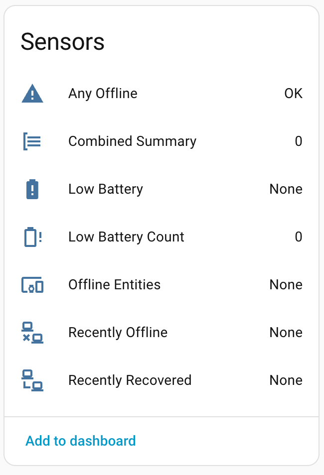

### Example Automation

Alert when anything across your entire home goes offline:

```yaml
automation:
  - alias: "Notify any device offline (whole home)"
    trigger:
      - platform: state
        entity_id: binary_sensor.entity_availability_all_devices_any_offline
        to: "on"
    action:
      - service: notify.mobile_app
        data:
          title: "Device Offline"
          message: >
            {{ states('sensor.entity_availability_all_devices_offline_entities') }}
```

---

## How Availability % Works

Availability sensors show what percentage of the time your entities were online during a given window (today, 3 days, 7 days, etc.).

The integration samples each entity's state in the background. If online, that time counts toward its availability. If offline, it doesn't.

**Group availability** is the average of all non-suppressed entities in the group.

**Example:** 3 entities monitored over 24 hours. Entity A was offline all day (0%), B and C were always online (100%). Group availability = 66.7%.

> **Important:** Availability sensors show `unavailable` right after the integration is first installed — this is normal. They will populate as data is collected.

---

## Services

> **`group:` takes the group *name*** (e.g. `Security Devices`), not the entity-ID slug. The UI action editor's group picker passes the config-entry ID automatically; in hand-written YAML, use the exact group name shown in Settings.

### `entity_availability.suppress`

Temporarily exclude an entity (or all entities in a group) from monitoring and offline alerts.

```yaml
# Suppress a single entity
service: entity_availability.suppress
data:
  entity_id: switch.garden_lights
  duration: 120  # minutes (default: 60, max: 10080)
```

```yaml
# Suppress all entities in a group
service: entity_availability.suppress
data:
  group: Security Devices
  duration: 60
```

> **Group field:** In the Actions UI, the `group` field shows a dropdown of all Entity Availability config entries. In YAML automations you can use either the group name (e.g. `security_devices`) or the config entry ID — both are accepted.

**Use case:** Suppress monitoring during planned maintenance, firmware updates, or known downtime.


### `entity_availability.unsuppress`

Resume monitoring for a previously suppressed entity or group.

```yaml
# Unsuppress a single entity
service: entity_availability.unsuppress
data:
  entity_id: switch.garden_lights
```

```yaml
# Unsuppress all entities in a group
service: entity_availability.unsuppress
data:
  group: Security Devices
```


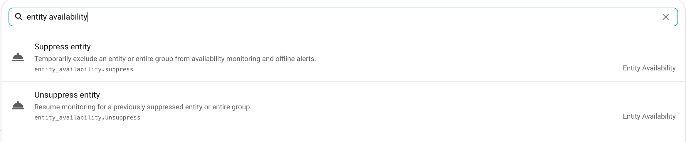

### `entity_availability.suppress_indefinitely`

Suppress an entity (or all entities in a group) with no expiry. The suppression remains active until explicitly cleared with `entity_availability.unsuppress`.

```yaml
# Suppress a single entity indefinitely
service: entity_availability.suppress_indefinitely
data:
  entity_id: switch.garden_lights
```

```yaml
# Suppress all entities in a group indefinitely
service: entity_availability.suppress_indefinitely
data:
  group: Security Devices
```

**Use case:** Decommissioned or long-term offline devices that you want to keep in the group without generating alerts. Because there is no expiry, remember to `unsuppress` when monitoring should resume.

### `entity_availability.reset_statistics`

Clear availability history **and** reliability counters (MTBF/MTTR, offline-event count) for an entity or an entire group. Availability % windows and the Reliability sensor start accumulating fresh.

```yaml
# Reset a single entity
service: entity_availability.reset_statistics
data:
  entity_id: sensor.living_room_temperature
```

```yaml
# Reset every entity in a group
service: entity_availability.reset_statistics
data:
  group: Security Devices
```

**Use case:** Run after planned maintenance (firmware flash, deliberate power-down) so a known outage does not permanently drag down the availability % or skew MTBF/MTTR.

---

## Bus Events

The integration fires two events on the Home Assistant event bus when a monitored entity crosses state (after its cooldown, and outside the 60 s startup grace period):

| Event | Fired when | Data |
|-------|-----------|------|
| `entity_availability_offline` | An entity is confirmed offline | `entity_id`, `group`, `offline_since` |
| `entity_availability_recovered` | An offline entity returns online | `entity_id`, `group`, `downtime_seconds` |

These are cleaner automation triggers than watching sensor attributes with templates:

```yaml
automation:
  - alias: Alert on any monitored entity going offline
    trigger:
      - platform: event
        event_type: entity_availability_offline
    action:
      - service: notify.mobile_app
        data:
          message: >-
            {{ trigger.event.data.entity_id }} in
            {{ trigger.event.data.group }} went offline.
```

---

## Automation Ideas

Ready-to-adapt automations for every feature — bus events, offline/recovery, availability %, reliability (MTBF/MTTR), battery, affected areas, combined groups, and services — live in **[AUTOMATION_EXAMPLES.md](AUTOMATION_EXAMPLES.md)**.

Two to get started:

```yaml
# Notify when any monitored entity goes offline
automation:
  alias: EA - any entity offline
  trigger:
    - platform: event
      event_type: entity_availability_offline
  action:
    - service: notify.mobile_app_my_phone
      data:
        message: "{{ trigger.event.data.entity_id }} in {{ trigger.event.data.group }} went offline."
```

```yaml
# Daily availability report
automation:
  alias: EA - daily report
  trigger:
    - platform: time
      at: "08:00:00"
  action:
    - service: notify.mobile_app_my_phone
      data:
        message: >
          Today: {{ states('sensor.entity_availability_security_devices_availability_today') }}%
          7-day: {{ states('sensor.entity_availability_security_devices_availability_7d') }}%
```

---

## Custom Lovelace Card

The integration ships with a custom card for quick health visualization. It is automatically registered as a Lovelace resource when the integration loads.

The card works with both regular groups and combined groups. It auto-detects the group type and adjusts its layout accordingly.

### Manual Installation (if auto-registration fails)

1. Add the resource in **Settings > Dashboards > Resources**:
   - URL: `/entity_availability/entity-availability-card.js`
   - Type: JavaScript Module

### Configuration

```yaml
type: custom:entity-availability-card
group: Security Devices
show_affected_areas: false
show_availability: true
show_entities: true
entities_expanded: false
show_actions: false
compact: false
entity_detail: "off"
entity_filter: "all"
sort_by: status
group_sort_by: name_asc
availability_thresholds:
  high: 99
  mid: 95
availability_colors:
  high: "#4caf50"
  mid: "#ff9800"
  low: "#f44336"
```

| Option | Default | Description |
|--------|---------|-------------|
| `group` | (required) | Group slug (e.g., `security_devices`) — works for both regular and combined groups |
| `title` | (auto from group) | Custom card title |
| `show_affected_areas` | `false` | Show offline area names as pills between stats and availability bars (both regular and combined groups) |
| `show_availability` | `true` | Show availability progress bars (regular groups only) |
| `show_entities` | `true` | Show expandable entity list (regular) or group breakdown table (combined) |
| `entities_expanded` | `false` | Start entity list / group breakdown expanded |
| `show_actions` | `false` | Show Suppress/Unsuppress buttons (regular groups only) |
| `entity_detail` | `"off"` | `"off"` / `"tooltip"` (hover to see details) / `"inline"` (always show details). In compact mode with inline, shows state + last-changed time. Timestamp states are formatted as readable dates. (regular groups only) |
| `entity_filter` | `"all"` | Filter entity list: `"all"`, `"offline"` (problems only: offline/stale/low battery), `"online"` (healthy only). Section title and count update to reflect filter (e.g., "Offline Entities (2/6)"). (regular groups only) |
| `compact` | `false` | Reduced padding mode |
| `sort_by` | `status` | Entity list sort order: `status`, `name_asc`, `name_desc`, `battery_asc`, `battery_desc` (regular groups only) |
| `group_sort_by` | `name_asc` | Group breakdown table sort order: `name_asc`, `name_desc`, `offline_desc` (most offline first). (combined groups only) |
| `availability_thresholds` | `{high: 99, mid: 95}` | % thresholds for bar colors (regular groups only) |
| `availability_colors` | `{high, mid, low}` | Custom hex colors for bars (regular groups only) |

> **Migration:** `show_entity_tooltips: true` from previous versions is automatically treated as `entity_detail: "tooltip"` — no manual update needed.

The `group` field accepts any group slug. The card uses the prefix `entity_availability_` + group slug to locate all related entities and detect the group type automatically.

All options are configurable via the visual card editor UI. Options that do not apply to the selected group type are hidden automatically in the editor.


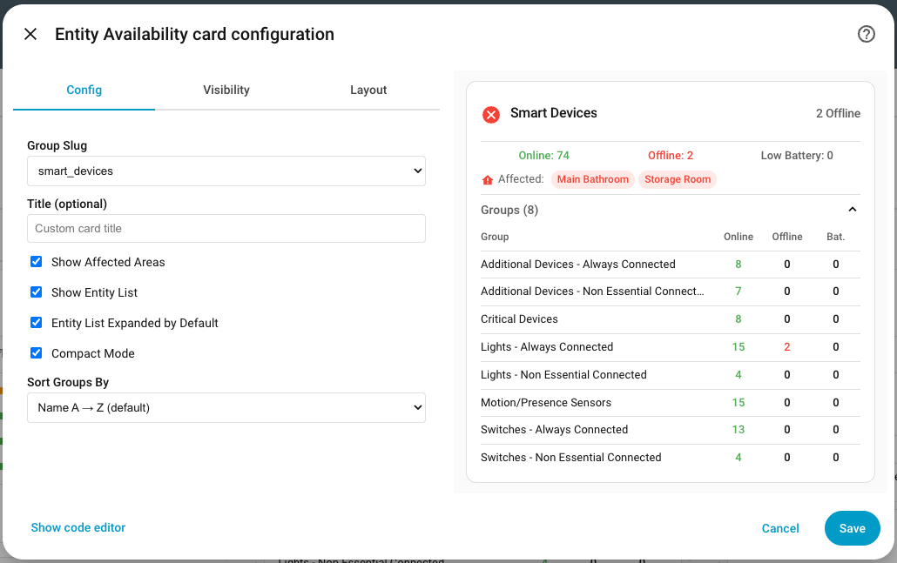

### Visual Editor

The card editor includes a **Group Slug** dropdown populated from all discovered groups, split into two sections:

- **Groups** — regular monitored groups
- **Combined Groups** — aggregated combined groups

Selecting a combined group hides editor controls that don't apply (availability bars, entity filter, entity detail, entity sort order, suppress buttons, color thresholds), and shows the **Sort Groups By** dropdown instead.

### Card Preview — Regular Group

```
┌───────────────────────────────────────────────┐
│ ✓ Security Devices                    All OK  │
├───────────────────────────────────────────────┤
│   Online: 4   Offline: 1   Low Battery: 1     │
├───────────────────────────────────────────────┤
│  Today   ██████████████████████░░░░   98.2%   │
│  7 Days  ████████████████████░░░░░░   95.1%   │
├───────────────────────────────────────────────┤
│  ▾ Entities (6)                               │
│    Entity            Condition       Bat.     │
│    ───────────────────────────────────────    │
│    ● Camera 1        Online          100%     │
│    ● Camera 2        Online           85%     │
│    ▲ Door Lock       Low Battery      18%     │
│    ✖ Sensor 3        Offline for 12m          │
│    ◌ Motion 1        Stale                    │
│    ● Smart Plug      Suppressed               │
├───────────────────────────────────────────────┤
│       [Suppress All]   [Unsuppress All]       │
└───────────────────────────────────────────────┘
```

### Card Preview — Combined Group

```
┌───────────────────────────────────────────────┐
│ ✖ All Devices                      2 Offline  │
├───────────────────────────────────────────────┤
│   Online: 11  Offline: 2   Low Battery: 1     │
├───────────────────────────────────────────────┤
│  ▾ Groups (3)                                 │
│    Group              Online  Offline  Bat.   │
│    ─────────────────────────────────────────  │
│    Security Devices       4        1     1    │
│    Climate Devices        5        1     0    │
│    Media Devices          2        0     0    │
└───────────────────────────────────────────────┘
```

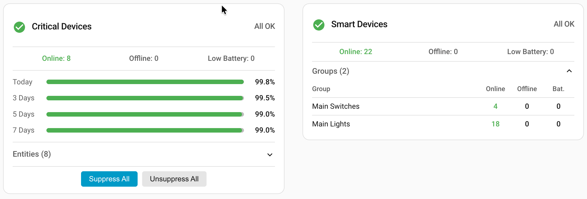

### Dashboard Example

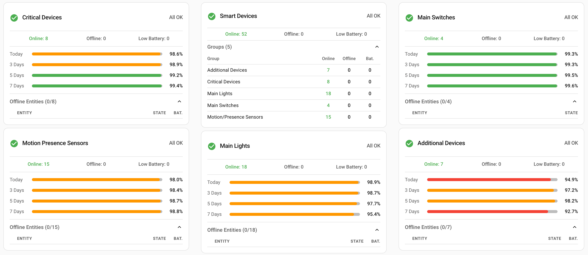

---

## FAQ

**Q: The card shows "configuration error" on the iOS Companion App but works in a browser. What's wrong?**
A: Two things can cause this. First, try **Settings → Companion App → Debug → Reset frontend cache** in the iOS app — WKWebView caches JS aggressively and a stale copy of the card can break after a HA update. Second, if resetting the cache doesn't help, update to v0.3.1 or later, which replaced the card's element bootstrap with a more reliable approach that works with the iOS WebView's load order.

**Q: Does this integration require the Recorder component?**
A: No. Entity Availability uses its own `.storage` file for tracking history. This keeps your database lean.

**Q: Why are availability sensors showing "unavailable" after installation?**
A: This is normal. Availability sensors need time to collect data before they can report a percentage. For "today" they need at least one 5-minute data point; for longer windows (3d, 7d) they need at least 10% of expected data. They will populate automatically as the integration runs.

**Q: What happens after a Home Assistant restart?**
A: Historical availability data is stored in `.storage` and survives restarts. The integration resumes tracking immediately. Offline alerts are suppressed for the first 60 seconds after startup to avoid false-positive notifications for entities that are already offline before HA finishes loading.

**Q: Can I monitor the same entity in multiple groups?**
A: Yes. An entity can belong to multiple groups simultaneously.

**Q: How does the cooldown work?**
A: When an entity enters a "bad" state, the integration waits for the configured cooldown period before marking it offline. If the entity recovers within the cooldown, it is never counted as offline. This prevents false alerts from brief connectivity blips. Recovery (going back online) is instant -- no cooldown on the way back.

**Q: What counts as "degraded"?**
A: An entity is degraded if its battery level is below the configured threshold, or if it has not reported a state change for longer than the staleness threshold.

**Q: How is the battery level determined?**
A: During setup, you map each entity to its battery sensor. Auto-detection finds battery sensors on the same device or by naming convention (`sensor.{name}_battery`). Both numeric (%) and text (`low`) battery states are supported.

**Q: Can I suppress an entity via automation?**
A: Yes. Use the `entity_availability.suppress` service in any automation or script.

**Q: How do I access all sensor values in templates?**
A: Use `states()` for the main value and `state_attr()` for attributes. Example: `{{ state_attr('sensor.entity_availability_security_devices_group_summary', 'online') }}`

**Q: Home Assistant reports a repair "... no longer has a state class" for a Group/Combined Summary sensor. What do I do?**
A: Expected after upgrading to v0.3.12. The `Group Summary` and `Combined Summary` sensors used to generate long-term statistics for a value (entity count) that rarely changes, bloating the recorder database. That was removed. Open **Settings → System → Repairs** and resolve the issue to purge the orphaned statistics rows, or delete them via **Developer Tools → Statistics**. The sensors keep working normally — only their unused statistics history is cleared.

---

## Contributing

Contributions are welcome! Please:

1. Fork the repository.
2. Create a feature branch (`git checkout -b feature/my-feature`).
3. Commit your changes with clear commit messages.
4. Open a Pull Request against `main`.

### Development Setup

```bash
git clone https://github.com/italo-lombardi/Home-Assistant-EntityAvailability.git

python -m venv venv
source venv/bin/activate

pip install homeassistant pytest pytest-homeassistant-custom-component
```

### Running Tests

```bash
python -m pytest tests/ -v
```

### Guidelines

- Follow the [Home Assistant integration development guidelines](https://developers.home-assistant.io/).
- Add translations for any new user-facing strings.
- Write tests for new functionality.
- Keep PRs focused -- one feature or fix per PR.

---

## Sibling Integrations

Other Home Assistant integrations by the same author:

| Integration | Description |
|-------------|-------------|
| [Entity Guard](https://github.com/italo-lombardi/Home-Assistant-EntityGuard) | Enforces entity state via declarative rules — replaces hand-written auto-off, auto-lock, and kill-switch automations |
| [Entity Distance](https://github.com/italo-lombardi/Home-Assistant-EntityDistance) | Tracks distance between 2–5 HA entities (persons, devices, zones) — direction, speed, ETA, proximity, group sensors |
| [Fuel Compare](https://github.com/italo-lombardi/Home-Assistant-FuelCompare) | Tracks live fuel prices from fuelcompare.ie |
| [WashWise](https://github.com/italo-lombardi/Home-Assistant-WashWise) | Decide whether to wash your car, bike, or solar panels — or skip garden irrigation — based on the weather forecast. Produces a verdict, 0–100 score, blocking reason, and per-day breakdown with a custom Lovelace card |

---

## License

This project is licensed under the GNU General Public License v3.0. See the [LICENSE](LICENSE) file for details.
