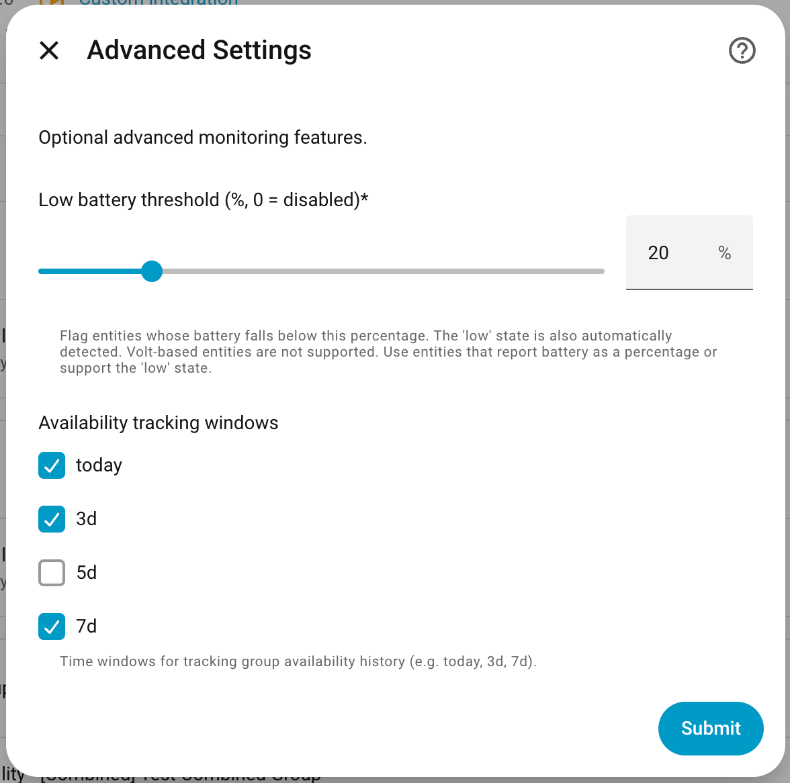
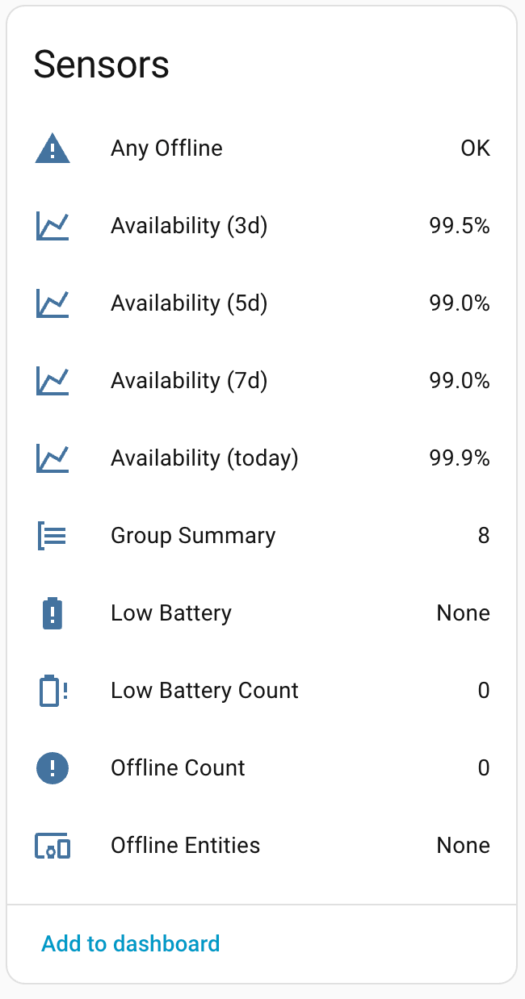
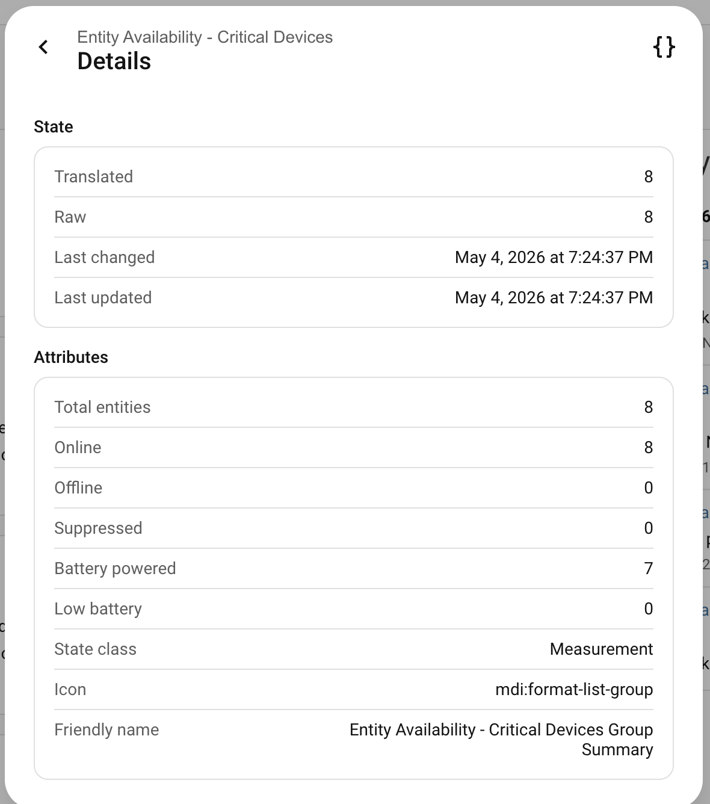
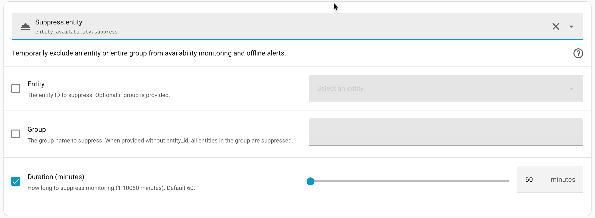
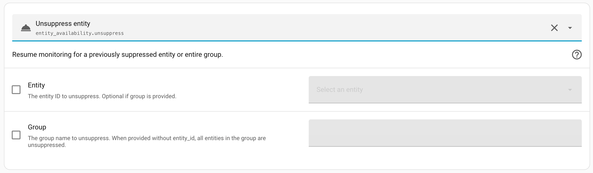
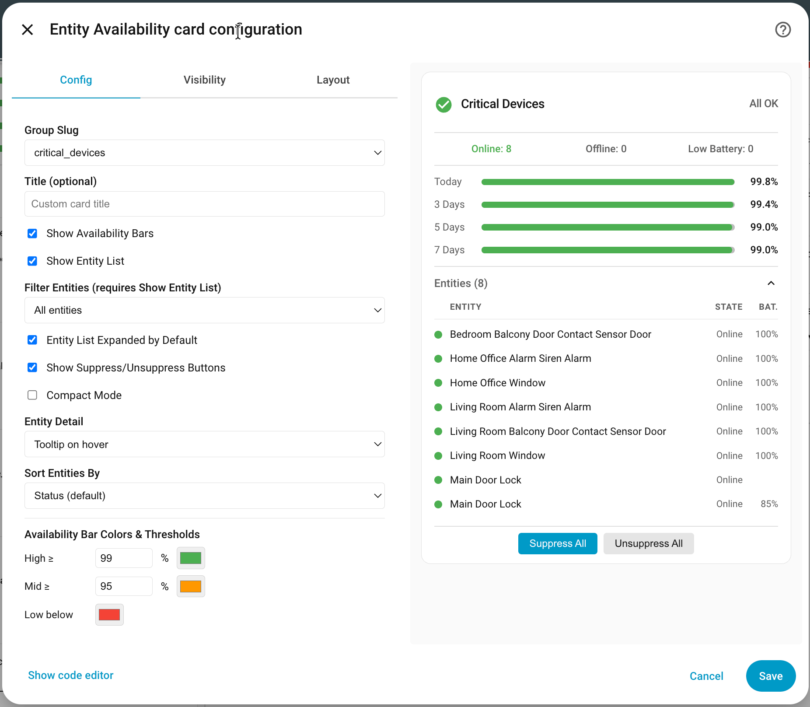

# Entity Availability for Home Assistant

<a href="https://github.com/italo-lombardi/Home-Assistant-EntityAvailability/releases"></a>
<a href="https://github.com/hacs/integration"></a>
<a href="https://github.com/italo-lombardi/Home-Assistant-EntityAvailability"></a>
<a href="https://www.home-assistant.io/"></a>
<a href="https://github.com/italo-lombardi/Home-Assistant-EntityAvailability/blob/main/LICENSE"></a>

Monitor entity availability in Home Assistant. Track offline entities, availability history, and degraded states with a custom dashboard card.

---

## Features

- **Multi-group support** -- organize entities by function (Security, Climate, Media, etc.)
- **Configurable bad states** -- define which states count as offline (`unavailable`, `unknown`, or custom)
- **Cooldown timer** -- ignore brief blips before marking an entity offline
- **Availability % sensors** -- track uptime over today, 3-day, 5-day, and 7-day windows
- **Battery monitoring** -- auto-detect or manually map battery entities; supports numeric (%) and text states (`low`)
- **Degraded entity detection** -- flag entities with low battery or stale data
- **Maintenance/suppression mode** -- temporarily exclude entities from monitoring
- **Custom Lovelace card** -- traffic-light status display with at-a-glance health overview
- **Self-managed storage** -- no recorder dependency; data stored in `.storage`
- **Survives HA restarts** -- availability history persisted via HA Store

---

## Installation

### HACS (Recommended)

1. Open HACS in your Home Assistant instance.
2. Go to **Integrations** and click the three-dot menu.
3. Select **Custom repositories**.
4. Add `https://github.com/italo-lombardi/Home-Assistant-EntityAvailability` with category **Integration**.
5. Click **Install** and restart Home Assistant.

### Manual

1. Download the [latest release](https://github.com/italo-lombardi/Home-Assistant-EntityAvailability/releases).
2. Copy the `custom_components/entity_availability/` folder into your `config/custom_components/` directory.
3. Restart Home Assistant.

---

## Configuration

This integration uses a config flow accessible from **Settings > Devices & Services > Add Integration > Entity Availability**.

### Step 1: Create Entity Group

| Field | Description |
|-------|-------------|
| Group Name | A descriptive name for this group (e.g., "Security Cameras") |
| Entities to Monitor | Select the entities you want to track |


### Step 2: Monitoring Settings

| Field | Default | Description |
|-------|---------|-------------|
| States considered offline | `unavailable`, `unknown` | States that mark an entity as offline |
| Cooldown (seconds) | `60` | Time to wait before confirming an entity is offline |
| Staleness threshold (minutes) | `0` (disabled) | Mark entity degraded if no state change in this time |


### Step 3: Advanced Settings

| Field | Default | Description |
|-------|---------|-------------|
| Low battery threshold (%) | `20` | Battery level below which an entity is considered degraded (0 = disabled) |
| Availability tracking windows | `today`, `7d` | Which time windows to create availability sensors for |



### Step 4: Battery Entity Mapping (when battery threshold > 0)

If you enable battery monitoring, a confirmation step appears showing each monitored entity with its auto-detected battery sensor. You can:

- **Confirm** the auto-detected battery entity
- **Override** with a different battery sensor
- **Leave empty** for entities that don't have batteries (e.g., smart plugs, cloud services)

Auto-detection strategies:
1. Device registry -- finds battery sensors on the same HA device
2. Convention -- checks for `sensor.{entity_name}_battery`

Battery sensors that report `low` (text) are supported in addition to numeric percentages.


### Options Flow

All settings can be edited after creation via **Settings > Devices & Services > Entity Availability > Configure**.

---

## Sensors Created

For each configured group, the following entities are created. All entity IDs use the prefix `entity_availability_` followed by the group slug (the lowercased, underscore-separated version of your group name).

For example, a group named "Security Devices" produces the slug `security_devices`:

| Entity | Type | State | Attributes |
|--------|------|-------|------------|
| `sensor..._offline_count` | Sensor | Number of entities currently offline | Per-entity offline status, timestamps, recovery info |
| `sensor..._offline_entities` | Sensor | Comma-separated list of offline entity names (`"None"` when all online) | Full entity list, count |
| `sensor..._low_battery` | Sensor | Comma-separated list of low battery entities (`"None"` when all OK) | Per-entity battery levels, count |
| `sensor..._low_battery_count` | Sensor | Number of entities with low battery | — |
| `sensor..._group_summary` | Sensor | Total entity count in the group | total_entities, online, offline, suppressed, battery_powered, low_battery |
| `sensor..._availability_today` | Sensor | Group availability % for today | Per-entity availability breakdown |
| `sensor..._availability_7d` | Sensor | Group availability % over 7 days | Per-entity availability breakdown |
| `binary_sensor..._any_offline` | Binary Sensor (Problem) | ON when at least one entity is offline | offline_entities, offline_count |

> **Note:** The Low Battery and Low Battery Count sensors are only created when battery threshold > 0. Availability window sensors are only created for windows selected during configuration.



### Group Summary Sensor

The Group Summary sensor provides a complete overview in its attributes:

| Attribute | Description |
|-----------|-------------|
| `total_entities` | Total number of entities in the group |
| `online` | Number of entities currently online |
| `offline` | Number of entities currently offline (excluding suppressed) |
| `suppressed` | Number of suppressed entities |
| `battery_powered` | Number of entities with a mapped battery sensor |
| `low_battery` | Number of entities with battery below threshold |
| `entities` | List of all monitored entity IDs in this group |
| `battery_levels` | Dict of `{entity_id: battery_level}` for entities with battery sensors |
| `suppressed_until` | Dict of `{entity_id: ISO datetime}` for entities with a timed suppression |
| `stale_entities` | List of entity IDs currently considered stale (no state change beyond threshold) |
| `offline_since` | Dict of `{entity_id: ISO datetime}` recording when each offline entity went offline |

Access these in templates:

```yaml
{{ state_attr('sensor.entity_availability_security_devices_group_summary', 'battery_powered') }}
{{ state_attr('sensor.entity_availability_security_devices_group_summary', 'offline') }}
```



### Recovery Attributes

When an entity comes back online, the `offline_count` sensor includes:

- `last_recovery` -- timestamp of when the entity came back online
- `last_downtime_seconds` -- how long the entity was offline (seconds)

---

## How Availability % Works

Availability is calculated using 5-minute time buckets (up to 7 days / 2016 buckets):

1. Every 30 seconds, the integration checks each entity's state
2. If online, the time is added to the current bucket's "online seconds"
3. If offline, the bucket exists but no online time is added
4. For a given window (e.g., "today" = last 24 hours), availability = `total online seconds / total seconds * 100`

**Group availability** is the average of all non-suppressed entity availabilities.

**Example:** 3 entities monitored over 24 hours. Entity A was offline all day (0%), B and C were always online (100%). Group availability = (0 + 100 + 100) / 3 = 66.7%.

> **Important:** Availability sensors will show as `unavailable` when the integration first starts. This is normal -- they need time to collect data before reporting a percentage. For "today" they need at least one 5-minute bucket; for longer windows (3d, 7d) they need at least 10% of the expected data before showing a value.

---

## Services

### `entity_availability.suppress`

Temporarily exclude an entity (or all entities in a group) from monitoring and offline alerts.

```yaml
# Suppress a single entity
service: entity_availability.suppress
data:
  entity_id: switch.garden_lights
  duration: 120  # minutes (default: 60, max: 10080)
```

```yaml
# Suppress all entities in a group
service: entity_availability.suppress
data:
  group: security_devices
  duration: 60
```

**Use case:** Suppress monitoring during planned maintenance, firmware updates, or known downtime.



### `entity_availability.unsuppress`

Resume monitoring for a previously suppressed entity or group.

```yaml
# Unsuppress a single entity
service: entity_availability.unsuppress
data:
  entity_id: switch.garden_lights
```

```yaml
# Unsuppress all entities in a group
service: entity_availability.unsuppress
data:
  group: security_devices
```




---

## Automation Ideas

### Notify when any entity goes offline

```yaml
automation:
  - alias: "Notify offline entity"
    trigger:
      - platform: state
        entity_id: binary_sensor.entity_availability_security_devices_any_offline
        to: "on"
    action:
      - service: notify.mobile_app
        data:
          title: "Entity Offline"
          message: >
            {{ state_attr('sensor.entity_availability_security_devices_offline_entities', 'entities') | join(', ') }}
```

### Notify when entity recovers

```yaml
automation:
  - alias: "Notify entity recovery"
    trigger:
      - platform: state
        entity_id: binary_sensor.entity_availability_security_devices_any_offline
        from: "on"
        to: "off"
    action:
      - service: notify.mobile_app
        data:
          title: "All Entities Online"
          message: "All security devices are back online."
```

### Daily availability report

```yaml
automation:
  - alias: "Daily availability report"
    trigger:
      - platform: time
        at: "08:00:00"
    action:
      - service: notify.mobile_app
        data:
          title: "Daily Availability"
          message: >
            Security: {{ states('sensor.entity_availability_security_devices_availability_today') }}%
            Climate: {{ states('sensor.entity_availability_climate_devices_availability_today') }}%
```

### Suppress during planned maintenance

```yaml
automation:
  - alias: "Suppress during firmware update"
    trigger:
      - platform: state
        entity_id: update.front_door_lock_firmware
        to: "on"
    action:
      - service: entity_availability.suppress
        data:
          entity_id: lock.front_door
          duration: 30
```

### Alert on low battery

```yaml
automation:
  - alias: "Low battery alert"
    trigger:
      - platform: numeric_state
        entity_id: sensor.entity_availability_security_devices_low_battery_count
        above: 0
    action:
      - service: notify.mobile_app
        data:
          title: "Low Battery Detected"
          message: >
            {{ states('sensor.entity_availability_security_devices_low_battery') }}
```

### Weekly reliability check

```yaml
automation:
  - alias: "Weekly reliability check"
    trigger:
      - platform: time
        at: "09:00:00"
    condition:
      - condition: time
        weekday: mon
    action:
      - service: notify.mobile_app
        data:
          title: "Weekly Reliability Report"
          message: >
            7-day availability: {{ states('sensor.entity_availability_security_devices_availability_7d') }}%
            Currently offline: {{ states('sensor.entity_availability_security_devices_offline_count') }}
```

---

## Custom Lovelace Card

The integration ships with a custom card for quick health visualization. It is automatically registered as a Lovelace resource when the integration loads.

### Manual Installation (if auto-registration fails)

1. Add the resource in **Settings > Dashboards > Resources**:
   - URL: `/entity_availability/entity-availability-card.js`
   - Type: JavaScript Module

### Configuration

```yaml
type: custom:entity-availability-card
group: security_devices
show_availability: true
show_entities: true
entities_expanded: false
show_actions: false
compact: false
entity_detail: "off"
entity_filter: "all"
sort_by: status
availability_thresholds:
  high: 99
  mid: 95
availability_colors:
  high: "#4caf50"
  mid: "#ff9800"
  low: "#f44336"
```

| Option | Default | Description |
|--------|---------|-------------|
| `group` | (required) | Group slug (e.g., `security_devices`) |
| `title` | (auto from group) | Custom card title |
| `show_availability` | `true` | Show availability progress bars |
| `show_entities` | `true` | Show expandable entity list |
| `entities_expanded` | `false` | Start entity list expanded |
| `show_actions` | `false` | Show Suppress/Unsuppress buttons |
| `entity_detail` | `"off"` | Entity detail mode: `"off"`, `"tooltip"` (hover), `"inline"` (always visible). When `compact: true` + `"inline"`, shows only HA State + last-changed duration. ISO timestamp states (e.g. `last_seen`) are auto-formatted to `Oct 15 · 14:30` |
| `entity_filter` | `"all"` | Filter entity list: `"all"`, `"offline"` (problems only: offline/stale/low battery), `"online"` (healthy only). Section title and count update to reflect filter (e.g., "Offline Entities (2/6)") |
| `compact` | `false` | Reduced padding mode |
| `sort_by` | `status` | Entity list sort order: `status`, `name_asc`, `name_desc`, `battery_asc`, `battery_desc` |
| `availability_thresholds` | `{high: 99, mid: 95}` | % thresholds for bar colors |
| `availability_colors` | `{high, mid, low}` | Custom hex colors for bars |

> **Migration:** `show_entity_tooltips: true` from previous versions is automatically treated as `entity_detail: "tooltip"` — no manual update needed.

The `group` field should be the group slug (e.g., `security_devices`). The card uses the prefix `entity_availability_` + group slug to locate all related entities automatically.

All options are configurable via the visual card editor UI.



### Card Preview

```
┌───────────────────────────────────────────────┐
│ ✓ Security Devices                    All OK  │
├───────────────────────────────────────────────┤
│   Online: 4   Offline: 1   Low Battery: 1     │
├───────────────────────────────────────────────┤
│  Today   ██████████████████████░░░░   98.2%   │
│  7 Days  ████████████████████░░░░░░   95.1%   │
├───────────────────────────────────────────────┤
│  ▾ Entities (6)                               │
│    Entity            Condition       Bat.     │
│    ───────────────────────────────────────    │
│    ● Camera 1        Online          100%     │
│    ● Camera 2        Online           85%     │
│    ▲ Door Lock       Low Battery      18%     │
│    ✖ Sensor 3        Offline for 12m          │
│    ◌ Motion 1        Stale                    │
│    ● Smart Plug      Suppressed               │
├───────────────────────────────────────────────┤
│       [Suppress All]   [Unsuppress All]       │
└───────────────────────────────────────────────┘
```

---

## FAQ

**Q: Does this integration require the Recorder component?**
A: No. Entity Availability uses its own `.storage` file for tracking history. This keeps your database lean.

**Q: Why are availability sensors showing "unavailable" after installation?**
A: This is normal. Availability sensors need time to collect data before they can report a percentage. For "today" they need at least one 5-minute data point; for longer windows (3d, 7d) they need at least 10% of expected data. They will populate automatically as the integration runs.

**Q: What happens after a Home Assistant restart?**
A: Historical availability data is stored in `.storage` and survives restarts. The integration resumes tracking immediately.

**Q: Can I monitor the same entity in multiple groups?**
A: Yes. An entity can belong to multiple groups simultaneously.

**Q: How does the cooldown work?**
A: When an entity enters a "bad" state, the integration waits for the configured cooldown period before marking it offline. If the entity recovers within the cooldown, it is never counted as offline. This prevents false alerts from brief connectivity blips. Recovery (going back online) is instant -- no cooldown on the way back.

**Q: What counts as "degraded"?**
A: An entity is degraded if its battery level is below the configured threshold, or if it has not reported a state change for longer than the staleness threshold.

**Q: How is the battery level determined?**
A: During setup, you map each entity to its battery sensor. Auto-detection finds battery sensors on the same device or by naming convention (`sensor.{name}_battery`). Both numeric (%) and text (`low`) battery states are supported.

**Q: Can I suppress an entity via automation?**
A: Yes. Use the `entity_availability.suppress` service in any automation or script.

**Q: How do I access all sensor values in templates?**
A: Use `states()` for the main value and `state_attr()` for attributes. Example: `{{ state_attr('sensor.entity_availability_security_devices_group_summary', 'online') }}`

---

## Contributing

Contributions are welcome! Please:

1. Fork the repository.
2. Create a feature branch (`git checkout -b feature/my-feature`).
3. Commit your changes with clear commit messages.
4. Open a Pull Request against `main`.

### Development Setup

```bash
git clone https://github.com/italo-lombardi/Home-Assistant-EntityAvailability.git

python -m venv venv
source venv/bin/activate

pip install homeassistant pytest pytest-homeassistant-custom-component
```

### Running Tests

```bash
python -m pytest tests/ -v
```

### Guidelines

- Follow the [Home Assistant integration development guidelines](https://developers.home-assistant.io/).
- Add translations for any new user-facing strings.
- Write tests for new functionality.
- Keep PRs focused -- one feature or fix per PR.

---

## License

This project is licensed under the GNU General Public License v3.0. See the [LICENSE](LICENSE) file for details.
